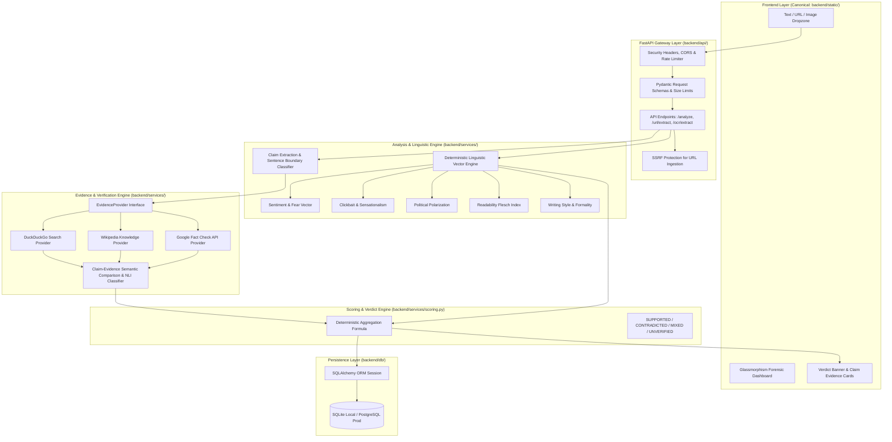

# TruthLens AI — System Architecture & Verification Methodology

## 1. System Overview

TruthLens AI is an evidence-first, multi-vector credibility and misinformation analysis platform. It analyzes user-submitted text, URLs, and image screenshots to extract declarative factual claims, assess linguistic risk signals, retrieve real-time corroborating/refuting evidence from authoritative knowledge sources, and compute a deterministic, explainable credibility verdict.

---

## 2. Core Architecture Pipeline

---

## 3. Separation of Concerns: Linguistic Risk vs Factual Truth

A fundamental tenet of TruthLens is the strict scientific distinction between **Linguistic Risk Signals** and **Factual Verification**:
- **Linguistic Signals** (Clickbait score, emotional tone, readability, writing style) analyze *how* something is written (rhetorical style). High clickbait or negative tone is an alert signal, but does **not** prove a claim is false.
- **Factual Verification** (Claim extraction, external evidence retrieval, source comparison) analyzes *what* is asserted against verified records and reporting.

---

## 4. Target Verdict Model

| Verdict | Meaning | Evidence Criteria |
|---|---|---|
| **`SUPPORTED`** | Core claims corroborated by authoritative sources. | Independent reputable sources verify the assertion without substantial dispute. |
| **`CONTRADICTED`** | Core claims directly refuted by reputable sources or documented fact checks. | Verified evidence contradicts key premises. |
| **`MIXED`** | Content contains both accurate facts and misleading/unsubstantiated claims. | Evidence shows partial truth or conflicting accounts. |
| **`UNVERIFIED`** | Insufficient corroborating evidence found in indexed knowledge repositories. | No authoritative external source has verified or refuted the claim. |

---

## 5. Security Architecture

1. **SSRF Guard (`url_extractor.py`)**: Validates URLs, resolves domain IPs, and blocks requests targeting private networks, loopback addresses (`127.0.0.1`, `localhost`), metadata endpoints (`169.254.169.254`), and non-HTTP protocols.
2. **Payload Protection**: Strict 25,000 character length limits, 5MB file upload caps, and 5-second external timeouts.
3. **Data Privacy**: Raw user articles are parsed in-memory and not permanently retained in the database; only structured scan IDs, anonymized snippets, and aggregated metrics are persisted.
4. **CORS & Security Headers**: Strict origin checks, `X-Content-Type-Options: nosniff`, and `X-Frame-Options: DENY`.
